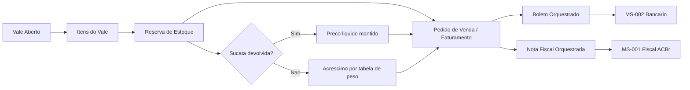
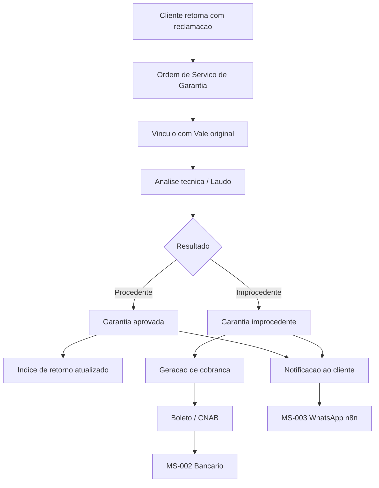
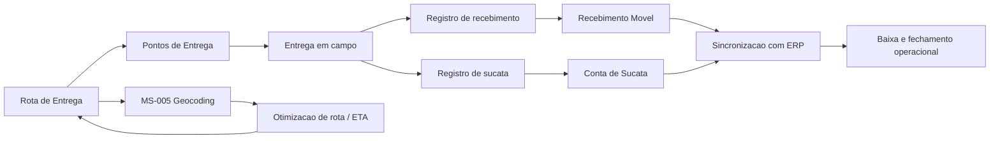
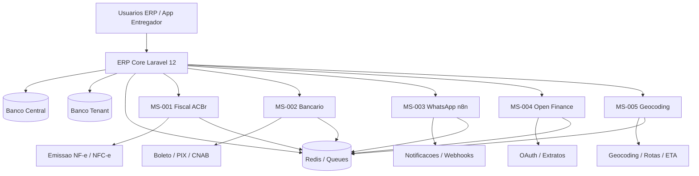

# BateriaExpert Architecture

## Visão Geral

O ERP BateriaExpert segue uma arquitetura Laravel monolítica para o core do ERP, com microserviços especializados para domínios externos como fiscal, bancário, notificações, Open Finance e geocoding.

## Componentes Principais

- `app/`: regras de negócio, Livewire, policies, jobs, eventos e integrações do ERP
- `database/migrations/central`: catálogo SaaS central, tenants, planos e billing
- `database/migrations/tenant`: schema canônico de cada banco operacional do ERP
- `microservicos/`: APIs desacopladas para integrações especializadas

## Multi-Tenancy

- O banco central mantém catálogo de clientes, credenciais e billing
- Cada tenant opera em banco físico isolado
- A resolução da conexão ativa acontece via `TenantConnectionMiddleware`
- O core do ERP não usa `filial_id` como mecanismo de isolamento

## Fluxo de Aplicação

1. O usuário acessa o domínio do tenant
2. O middleware resolve o tenant no catálogo central
3. A aplicação troca a conexão para o banco físico do tenant
4. O módulo solicitado executa regras, jobs e eventos localmente
5. Quando necessário, o core delega para microserviços externos

## Módulos Core

- `001`: tenant management e catálogo central
- `002`: autenticação e RBAC
- `003`: cadastros estruturais
- `004`: estoque e logística reversa
- `005`: vendas, vales e OS
- `006`: logística e entregas
- `007`: garantias e feedback
- `008`: financeiro inteligente
- `009`: orquestração fiscal e bancária
- `010`: backbone de integração, contratos canônicos, replay operacional e observabilidade
- `011`: control plane comercial central com planos, assinaturas, faturas SaaS, bloqueio e reativação
- `012`: payments control plane central com emissão externa, webhooks idempotentes, conciliação e exceções financeiras
- `013`: revenue recovery central com régua de cobrança, escalonamento, promessas e reengajamento
- `014`: analytics comercial central com snapshots, coortes, canais, riscos e drill-down executivo
- `015`: observabilidade operacional central com snapshots, baselines, incidentes e runbooks auditáveis
- `016`: consolidação do stack externo de monitoramento com scrape health, alertas materiais, dashboards versionados e rollback auditável
- `017`: governança central de benchmark, gargalos, tuning e rollback de performance nas integrações críticas
- `018`: governança central de branding, tema versionado, publicação validada e rollback auditável de white label por tenant
- `019`: hub executivo central com snapshots reutilizáveis, exportações Excel/PDF auditáveis e reexecução governada de relatórios
- `020`: automação avançada de recuperação de receita com jornadas adaptativas, experimentos governados e rollback auditável
- `021`: internacionalização central da plataforma com preferência por operador, publicação governada, cobertura inspecionável e rollback auditável
- `022`: múltiplas moedas centrais com preferência por operador, tabela de câmbio governada, inspeção reutilizável e rollback auditável

## Integrações Externas

- `MS-001`: fiscal ACBr
- `MS-002`: bancário/CNAB
- `MS-003`: WhatsApp e workflows
- `MS-004`: Open Finance
- `MS-005`: geocoding e rotas

## Backbone de Integração

- contratos versionados em `contratos_evento`
- publicação confiável com `evento_outboxes`
- consumo idempotente com `evento_inboxes`
- rastreabilidade de entrega em `entregas_integracao`
- catálogo síncrono controlado em `endpoints_integracao`
- inspeção operacional via `/integration/backbone` e `/api/integration/inspections`

## Control Plane Comercial

- o banco central mantém `planos`, `assinaturas`, `faturas`, `politicas_inadimplencia` e `eventos_comerciais_assinante`
- o módulo `011` não grava estado comercial nos bancos tenant
- grace period, bloqueio e reativação atualizam o cadastro central do assinante e o `BillingAccessGuard`
- eventos comerciais (`ASSINATURA_ATIVADA`, `PLANO_ALTERADO`, `GRACE_PERIOD_INICIADO`, `ASSINANTE_BLOQUEADO`, `ASSINANTE_REATIVADO`, `ASSINATURA_CANCELADA`) são publicados no backbone `010`
- o painel central opera via Livewire em rotas administrativas de billing e suporta inspeção JSON em `/admin/billing/inspection`

## Platform Payments and Reconciliation

- o banco central mantém `gateways_cobranca_saas`, `cobrancas_saas_externas`, `retornos_pagamento_saas`, `conciliacoes_pagamento_saas` e `excecoes_conciliacao_saas`
- o módulo `012` emite cobranças externas sempre vinculadas a uma `FaturaSaaS` do módulo `011`
- webhooks e retornos são ingeridos com chave de idempotência e só liquidam a fatura quando o match é seguro
- divergências de referência ou valor abrem exceções operacionais centrais sem sobrescrever o histórico financeiro original
- replay manual de retornos usa job/comando dedicado, preserva o retorno original e registra auditoria explícita em `audit_logs`
- eventos financeiros (`COBRANCA_SAAS_LIQUIDADA`, `CONCILIACAO_SAAS_PENDENTE`) são publicados no backbone `010` em escopo central
- o painel central opera via Livewire em `/admin/payments`, suporta emissão em `/admin/payments/emitir` e inspeção JSON em `/admin/payments/inspection`

## Platform Revenue Recovery

- o banco central mantém `politicas_recuperacao_receita`, `casos_recuperacao_receita`, `acoes_recuperacao_receita`, `compromissos_pagamento` e `indicadores_recuperacao_receita`
- o módulo `013` abre casos a partir de atraso, falha de cobrança ou reabertura por reversão financeira
- a régua é deduplicada por obrigação, estágio e canal para evitar contatos duplicados
- promessas de pagamento pausam somente as ações incompatíveis e preservam a observabilidade do caso
- escalonamentos críticos geram tarefas internas rastreáveis e podem atribuir responsável operacional
- eventos de recuperação (`RECUPERACAO_RECEITA_INICIADA`, `ACAO_COBRANCA_AGENDADA`, `CASO_RECUPERACAO_ESCALADO`, `PROMESSA_PAGAMENTO_REGISTRADA`) são publicados no backbone `010`
- o painel central opera via Livewire em `/admin/recovery`, suporta operação manual em `/admin/recovery/operacoes` e inspeção JSON em `/admin/recovery/inspection`

## Platform Commercial Analytics

- o banco central mantém `snapshots_analytics_comercial`, `recortes_coorte_comercial`, `metric_channel_performance`, `insights_risco_comercial` e `drilldowns_analytics_comercial`
- o módulo `014` deriva métricas executivas a partir dos módulos `011`, `012` e `013`, sem se tornar fonte transacional
- snapshots são reconstruíveis, auditáveis e publicam eventos materiais no backbone `010`
- recortes por coorte e canal preservam comparabilidade histórica dentro da janela reconstruída
- drill-down central liga métricas agregadas aos registros operacionais de assinatura, fatura e recovery
- o painel central opera via Livewire em `/admin/analytics` e suporta inspeção JSON em `/admin/analytics/inspection`

## Production Observability Assurance

- o banco central mantém `operational_slo_definitions`, `operational_alert_snapshots`, `load_test_baselines`, `operational_incident_records` e `runbook_execution_evidences`
- o módulo `015` consolida sinais dos módulos `010` a `014` sem se tornar nova fonte transacional de domínio
- snapshots operacionais classificam severidade a partir de backlog, latência, falha, replay pendente e indisponibilidade de coletor
- baselines de carga comparam throughput, latência p95 e taxa de erro contra tolerâncias explícitas
- incidentes centrais só podem ser encerrados após evidência concluída e `post_validation_passed`
- eventos operacionais materiais (`INCIDENTE_OPERACIONAL_ABERTO`, `SERVICO_DEGRADADO_DETECTADO`, `BASELINE_CARGA_ATUALIZADO`) são publicados no backbone `010`
- o painel central opera via Livewire em `/admin/operations` e a inspeção JSON reutilizável fica em `/admin/operations/inspection`

## Backbone Monitoring Consolidation

- o banco central mantém `monitoring_target_catalogs`, `monitoring_probe_snapshots`, `alert_rule_definitions`, `dashboard_provisioning_records` e `monitoring_readiness_evidences`
- o módulo `016` registra o estado operacional do stack externo sem substituir Prometheus ou Grafana como camadas de coleta e visualização
- scrape health diferencia explicitamente target degradado, coletor indisponível e ausência de materialização saudável
- regras de alerta versionadas avaliam fluxo, severidade, threshold e target materializado de forma auditável
- o lifecycle de dashboards suporta registro, aplicação, validação e rollback com evidência persistida
- eventos materiais (`SCRAPE_HEALTH_CRITICO`, `MONITORAMENTO_DEGRADADO`, `DASHBOARD_MONITORAMENTO_ATUALIZADO`, `ROLLBACK_MONITORAMENTO_EXECUTADO`) são publicados no backbone `010`
- o painel central opera via Livewire em `/admin/monitoring` e a inspeção JSON reutilizável fica em `/admin/monitoring/inspection`

## Critical Integration Load Optimization

- o banco central mantém `load_scenario_profiles`, `benchmark_execution_records`, `performance_bottleneck_records`, `tuning_change_records` e `performance_rollback_evidences`
- o módulo `017` registra benchmarks reproduzíveis sem deslocar baseline, decisão de tuning ou evidência de rollback para planilhas externas
- comparações classificam execução como `improved`, `stable` ou `regressed` a partir de throughput, latência p95 e taxa de erro
- gargalos distinguem banco, fila, integração externa e camada aplicacional com vínculo explícito ao benchmark executado
- mudanças de tuning só podem ser promovidas após validação positiva e preservam rollback auditável quando a reexecução degrada capacidade
- eventos materiais (`BENCHMARK_REGRESSIVO_DETECTADO`, `BASELINE_CARGA_PROMOVIDA`, `GARGALO_CRITICO_IDENTIFICADO`, `ROLLBACK_PERFORMANCE_EXECUTADO`) são publicados no backbone `010`
- o painel central opera via Livewire em `/admin/capacity` e a inspeção JSON reutilizável fica em `/admin/capacity/inspection`

## Advanced White Label Experience

- o banco central mantém `brand_identity_profiles`, `tenant_theme_versions`, `theme_asset_records`, `theme_publication_records` e `theme_rollback_evidences`
- o módulo `018` transforma o white label legado em workflow governado, sem depender de customização manual direta de layouts ou assets no deploy
- tokens visuais obrigatórios e contraste mínimo são validados antes da promoção de uma versão de tema
- publicações atualizam o `white_label_configs` aplicado ao shell tenant-aware como projeção operacional do tema ativo
- rollbacks restauram a última versão saudável ou o fallback seguro preservando evidência auditável da reversão
- eventos materiais (`TEMA_WHITE_LABEL_PUBLICADO`, `ROLLBACK_TEMA_WHITE_LABEL_EXECUTADO`) são publicados no backbone `010`
- o painel central opera via Livewire em `/admin/branding` e a inspeção JSON reutilizável fica em `/admin/branding/inspection`

## Executive Reporting Hub

- o banco central mantém `executive_analytics_snapshots`, `executive_report_definitions`, `executive_report_exports` e `executive_report_execution_logs`
- o módulo `019` reutiliza agregações do módulo `014` para preservar consistência entre dashboard, inspeção e artefatos exportados
- snapshots executivos guardam filtros normalizados, KPIs e drill-downs prontos para leitura super admin e reuso governado
- exportações Excel e PDF nascem do mesmo snapshot consistente, preservando `scope_summary`, operador, formato e referência de arquivo
- reexecuções criam nova trilha auditável sem perder vínculo com a exportação original
- eventos materiais (`RELATORIO_EXECUTIVO_GERADO`, `RELATORIO_EXECUTIVO_REEXECUTADO`, `RELATORIO_EXECUTIVO_FALHOU`) são publicados no backbone `010`
- o painel central opera via Livewire em `/admin/reports` e a inspeção JSON reutilizável fica em `/admin/reports/inspection`

## Advanced Revenue Recovery Automation

- o banco central mantém `recovery_automation_policy_versions`, `recovery_automation_journeys`, `recovery_automation_dispatches`, `recovery_automation_experiments` e `recovery_automation_violations`
- o módulo `020` reutiliza casos e ações do módulo `013` sem duplicar a fonte operacional da cobrança
- jornadas adaptativas respeitam fallback por canal, cooldown, supressão e idempotência antes de qualquer novo dispatch
- políticas versionadas só são promovidas após validação explícita e podem ativar experimento ou holdout auditável por jornada
- violações críticas habilitam rollback governado para a última política saudável, marcando jornadas afetadas e preservando `rollback_context`
- eventos materiais (`POLITICA_AUTOMACAO_RECUPERACAO_PUBLICADA`, `ROLLBACK_AUTOMACAO_RECUPERACAO_EXECUTADO`) são publicados no backbone `010`
- o painel central opera via Livewire em `/admin/recovery/automation` e a inspeção JSON reutilizável fica em `/admin/recovery/automation/inspection`

## Platform Internationalization

- o banco central mantém `platform_locale_publication_records` e `platform_locale_missing_key_reports`, além da preferência `usuarios_plataforma.preferred_locale`
- o módulo `021` resolve locale por request administrativo usando preferência persistida do operador, sessão ativa e fallback governado
- publicações de locale só são promovidas quando `default_locale`, `fallback_locale` e cobertura mínima das chaves críticas são consistentes
- lacunas de tradução permanecem inspecionáveis por severidade e locale, sem quebrar a publicação saudável anterior
- rollback restaura a última publicação elegível e marca a publicação degradada com trilha auditável de reversão
- eventos materiais (`LOCALIZACAO_PLATAFORMA_PUBLICADA`, `ROLLBACK_LOCALIZACAO_PLATAFORMA_EXECUTADO`) são publicados no backbone `010`
- o painel central opera via Livewire em `/admin/localization` e a inspeção JSON reutilizável fica em `/admin/localization/inspection`

## Multi-Currency Support

- o banco central mantém `platform_currency_catalog_entries`, `platform_currency_publication_records`, `platform_currency_rate_entries` e `platform_currency_issue_reports`, além da preferência `usuarios_plataforma.preferred_currency`
- o módulo `022` resolve moeda de exibição por request administrativo sem alterar o valor base histórico já persistido nos módulos centrais
- publicações de moeda promovem catálogo suportado, moeda base, moeda padrão e snapshot de taxas de câmbio em pacote versionado
- inconsistências de cobertura ou taxa permanecem inspecionáveis por moeda e severidade, sem apagar a última publicação saudável
- rollback reativa a última tabela elegível e marca a publicação degradada com trilha auditável de reversão
- eventos materiais (`MOEDAS_PLATAFORMA_PUBLICADAS`, `ROLLBACK_MOEDAS_PLATAFORMA_EXECUTADO`) são publicados no backbone `010`
- o painel central opera via Livewire em `/admin/currencies` e a inspeção JSON reutilizável fica em `/admin/currencies/inspection`

## Padrões Técnicos

- Laravel 12 como núcleo de aplicação
- Livewire para interfaces reativas
- Jobs enfileirados para fluxos assíncronos
- Events/Listeners para desacoplamento de domínio
- Policies e Gates para controle de acesso
- PostgreSQL/Supabase como referência de persistência

## Diagramas

### 1. Fluxo de Venda

### 2. Fluxo de Garantia

### 3. Fluxo de Logistica

### 4. Arquitetura dos Microservicos

### 5. Modelo de Dados Simplificado

