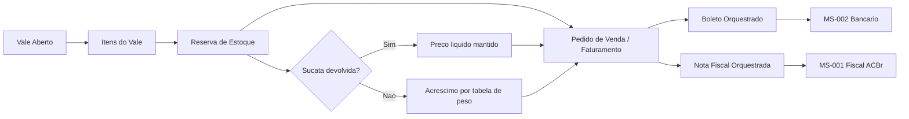
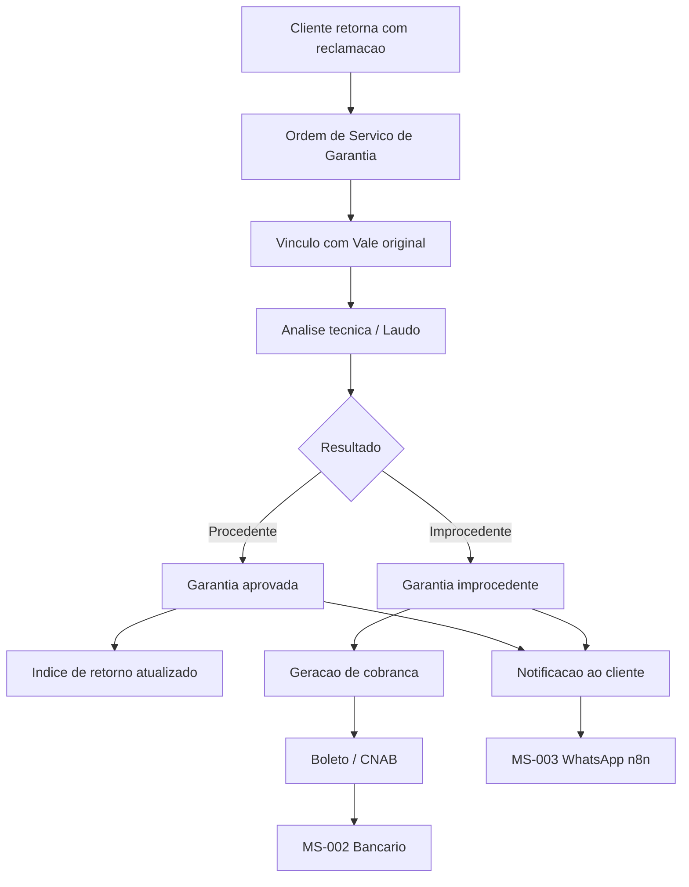
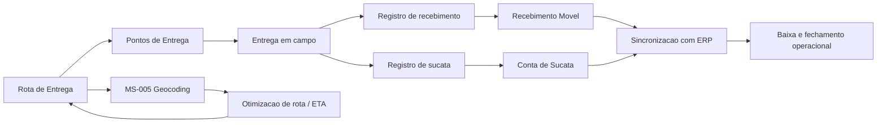
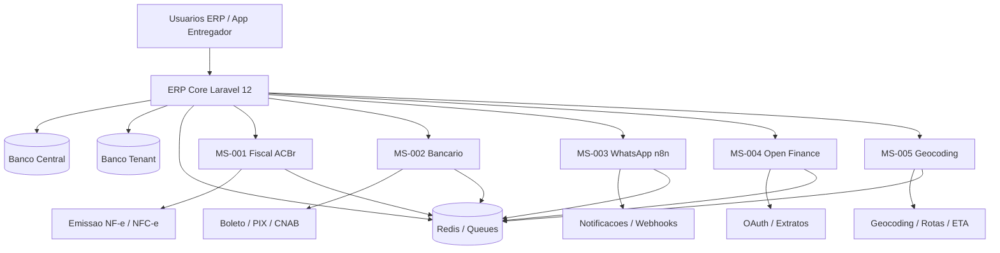
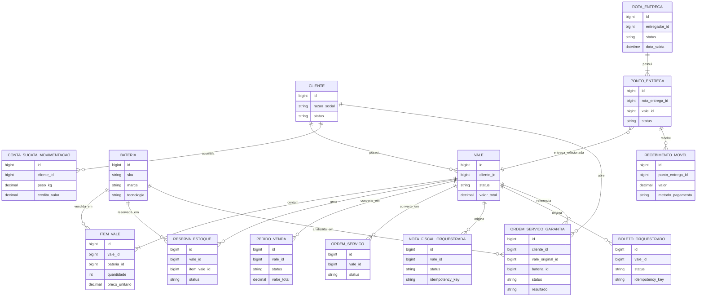

# BateriaExpert Architecture

## Visão Geral

O ERP BateriaExpert segue uma arquitetura Laravel monolítica para o core do ERP, com microserviços especializados para domínios externos como fiscal, bancário, notificações, Open Finance e geocoding.

## Componentes Principais

- `app/`: regras de negócio, Livewire, policies, jobs, eventos e integrações do ERP
- `database/migrations/central`: catálogo SaaS central, tenants, planos e billing
- `database/migrations/tenant`: schema canônico de cada banco operacional do ERP
- `microservicos/`: APIs desacopladas para integrações especializadas

## Multi-Tenancy

- O banco central mantém catálogo de clientes, credenciais e billing
- Cada tenant opera em banco físico isolado
- A resolução da conexão ativa acontece via `TenantConnectionMiddleware`
- O core do ERP não usa `filial_id` como mecanismo de isolamento

## Fluxo de Aplicação

1. O usuário acessa o domínio do tenant
2. O middleware resolve o tenant no catálogo central
3. A aplicação troca a conexão para o banco físico do tenant
4. O módulo solicitado executa regras, jobs e eventos localmente
5. Quando necessário, o core delega para microserviços externos

## Módulos Core

- `001`: tenant management e catálogo central
- `002`: autenticação e RBAC
- `003`: cadastros estruturais
- `004`: estoque e logística reversa
- `005`: vendas, vales e OS
- `006`: logística e entregas
- `007`: garantias e feedback
- `008`: financeiro inteligente
- `009`: orquestração fiscal e bancária
- `010`: backbone de integração, contratos canônicos, replay operacional e observabilidade
- `011`: control plane comercial central com planos, assinaturas, faturas SaaS, bloqueio e reativação
- `012`: payments control plane central com emissão externa, webhooks idempotentes, conciliação e exceções financeiras

## Integrações Externas

- `MS-001`: fiscal ACBr
- `MS-002`: bancário/CNAB
- `MS-003`: WhatsApp e workflows
- `MS-004`: Open Finance
- `MS-005`: geocoding e rotas

## Backbone de Integração

- contratos versionados em `contratos_evento`
- publicação confiável com `evento_outboxes`
- consumo idempotente com `evento_inboxes`
- rastreabilidade de entrega em `entregas_integracao`
- catálogo síncrono controlado em `endpoints_integracao`
- inspeção operacional via `/integration/backbone` e `/api/integration/inspections`

## Control Plane Comercial

- o banco central mantém `planos`, `assinaturas`, `faturas`, `politicas_inadimplencia` e `eventos_comerciais_assinante`
- o módulo `011` não grava estado comercial nos bancos tenant
- grace period, bloqueio e reativação atualizam o cadastro central do assinante e o `BillingAccessGuard`
- eventos comerciais (`ASSINATURA_ATIVADA`, `PLANO_ALTERADO`, `GRACE_PERIOD_INICIADO`, `ASSINANTE_BLOQUEADO`, `ASSINANTE_REATIVADO`, `ASSINATURA_CANCELADA`) são publicados no backbone `010`
- o painel central opera via Livewire em rotas administrativas de billing e suporta inspeção JSON em `/admin/billing/inspection`

## Platform Payments and Reconciliation

- o banco central mantém `gateways_cobranca_saas`, `cobrancas_saas_externas`, `retornos_pagamento_saas`, `conciliacoes_pagamento_saas` e `excecoes_conciliacao_saas`
- o módulo `012` emite cobranças externas sempre vinculadas a uma `FaturaSaaS` do módulo `011`
- webhooks e retornos são ingeridos com chave de idempotência e só liquidam a fatura quando o match é seguro
- divergências de referência ou valor abrem exceções operacionais centrais sem sobrescrever o histórico financeiro original
- replay manual de retornos usa job/comando dedicado, preserva o retorno original e registra auditoria explícita em `audit_logs`
- eventos financeiros (`COBRANCA_SAAS_LIQUIDADA`, `CONCILIACAO_SAAS_PENDENTE`) são publicados no backbone `010` em escopo central
- o painel central opera via Livewire em `/admin/payments`, suporta emissão em `/admin/payments/emitir` e inspeção JSON em `/admin/payments/inspection`

## Padrões Técnicos

- Laravel 12 como núcleo de aplicação
- Livewire para interfaces reativas
- Jobs enfileirados para fluxos assíncronos
- Events/Listeners para desacoplamento de domínio
- Policies e Gates para controle de acesso
- PostgreSQL/Supabase como referência de persistência

## Diagramas

### 1. Fluxo de Venda

### 2. Fluxo de Garantia

### 3. Fluxo de Logistica

### 4. Arquitetura dos Microservicos

### 5. Modelo de Dados Simplificado

