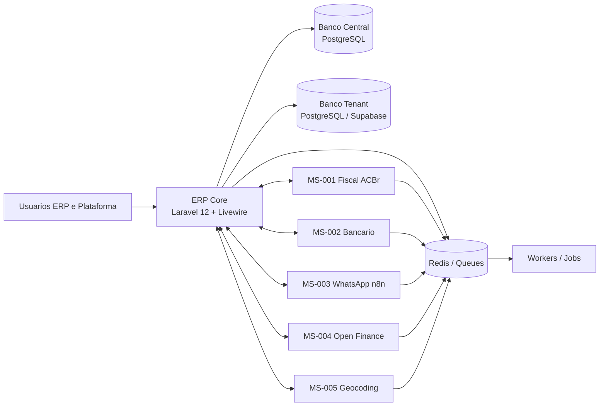

# BateriaExpert ERP

[](#testes)
[](#testes)
[](#stack)
[](#stack)
[](./composer.json)
[](#rodando-com-docker)

ERP especializado para distribuidores, revendas e operacoes de baterias automotivas, com arquitetura `database-per-client`, backoffice SaaS central e microservicos dedicados para fiscal, bancario, notificacoes, Open Finance e geocoding.

## Visao Geral

O BateriaExpert foi estruturado como um monorepo com:

- ERP Core em Laravel 12
- Autenticacao e UI com Jetstream, Livewire e Volt
- Banco central para catalogo SaaS, assinaturas e provisionamento
- Bancos isolados por tenant/CNPJ
- Microservicos independentes para integracoes especializadas

Os modulos core cobrem:

- multi-tenancy isolado
- RBAC
- cadastros estruturais
- estoque e logistica reversa
- vendas, pedidos e OS
- logistica e entregas
- garantias e feedback
- financeiro inteligente
- orquestracao fiscal e bancaria

## Arquitetura



## Stack

- PHP `^8.3`
- Laravel `12`
- Livewire `4`
- Volt
- PostgreSQL `15+`
- Redis
- Vite
- Docker Compose para ambiente integrado

## Pre-requisitos

Para desenvolvimento local sem Docker:

- PHP `8.3+`
- Composer `2+`
- Node.js `20+`
- npm
- PostgreSQL `15+`
- Redis

Para ambiente integrado:

- Docker
- Docker Compose

## Instalacao Local

### 1. Clonar o repositorio

```bash
git clone <seu-repo>.git
cd laravel12-jetstream-template
```

### 2. Instalar dependencias

```bash
composer install
npm install
```

### 3. Configurar ambiente

```bash
cp .env.example .env
php artisan key:generate
```

### 4. Configurar PostgreSQL central

Use o guia:

- [POSTGRESQL_LOCAL_SETUP.md](./POSTGRESQL_LOCAL_SETUP.md)

Depois valide com:

```bash
./check-pg.sh
```

### 5. Ajustar `.env`

Exemplo minimo para o banco central:

```dotenv
DB_CONNECTION=central
DB_CENTRAL_DRIVER=pgsql
DB_CENTRAL_HOST=localhost
DB_CENTRAL_PORT=5432
DB_CENTRAL_DATABASE=erp_central
DB_CENTRAL_USERNAME=gil
DB_CENTRAL_PASSWORD=sua_senha
```

### 6. Rodar migrations centrais

```bash
php artisan migrate --database=central --path=database/migrations/central --no-interaction
```

### 7. Popular dados iniciais

```bash
php artisan db:seed --class=PlanosSeeder --no-interaction
php artisan db:seed --class=SuperAdminSeeder --no-interaction
```

### 8. Subir a aplicacao

```bash
composer run dev
```

Se preferir processos separados:

```bash
php artisan serve
php artisan queue:listen --tries=1
npm run dev
```

## 📚 Documentação

- **[README.md](README.md)** - Visão geral do projeto
- **[ARCHITECTURE.md](ARCHITECTURE.md)** - Arquitetura do sistema e diagramas
- **[DATABASE.md](DATABASE.md)** - Modelo de dados e relacionamentos
- **[API_GUIDE.md](API_GUIDE.md)** - Guia de uso da API
- **[MICROSERVICES.md](MICROSERVICES.md)** - Detalhamento dos microserviços
- **[FAQ.md](FAQ.md)** - Perguntas frequentes
- **[CONTRIBUTING.md](CONTRIBUTING.md)** - Guia para contribuidores
- **[CODE_OF_CONDUCT.md](CODE_OF_CONDUCT.md)** - Código de conduta
- **[SECURITY.md](SECURITY.md)** - Política de segurança
- **[SUPPORT.md](SUPPORT.md)** - Canais de suporte
- **[CHANGELOG.md](CHANGELOG.md)** - Histórico de versões
- **[ROADMAP.md](ROADMAP.md)** - Roadmap do projeto
- **[RELEASE_PROCESS.md](RELEASE_PROCESS.md)** - Processo de release
- **[TROUBLESHOOTING.md](TROUBLESHOOTING.md)** - Solução de problemas

## Testes

Rodar a suite completa:

```bash
php artisan test --compact
```

Rodar um arquivo especifico:

```bash
php artisan test --compact tests/Feature/SalesServiceOsTest.php
```

Formatacao:

```bash
vendor/bin/pint --dirty --format agent
```

## Rodando com Docker

O `docker-compose.yml` da raiz sobe os microservicos scaffoldados:

- `MS-001 Fiscal`
- `MS-002 Bancario`
- `MS-003 WhatsApp n8n`
- `MS-004 Open Finance`
- `MS-005 Geocoding`

Subir o stack:

```bash
docker compose up -d --build
```

Validar containers:

```bash
docker compose ps
```

Executar healthcheck:

```bash
./healthcheck.sh
```

## Scripts Operacionais

- [check-pg.sh](./check-pg.sh): verifica PostgreSQL local
- [backup.sh](./backup.sh): backup do banco central e opcionalmente de tenant
- [restore.sh](./restore.sh): restore a partir de dump PostgreSQL
- [healthcheck.sh](./healthcheck.sh): valida endpoints principais

## Documentacao

### API

- [openapi.yaml](./openapi.yaml)
- [postman_collection.json](./postman_collection.json)
- [API_GUIDE.md](./API_GUIDE.md)
- [MICROSERVICES.md](./MICROSERVICES.md)

### Deploy

- [DEPLOY_PROXMOX.md](./DEPLOY_PROXMOX.md)
- [DEPLOY_SUPABASE.md](./DEPLOY_SUPABASE.md)
- [DEPLOY_PRODUCAO.md](./DEPLOY_PRODUCAO.md)
- [DEPLOYMENT_DETAILED.md](./DEPLOYMENT_DETAILED.md)

### Operacao

- [TROUBLESHOOTING.md](./TROUBLESHOOTING.md)
- [PERFORMANCE.md](./PERFORMANCE.md)

### Governanca

- [CONTRIBUTING.md](./CONTRIBUTING.md)
- [CODE_OF_CONDUCT.md](./CODE_OF_CONDUCT.md)
- [SECURITY.md](./SECURITY.md)
- [SUPPORT.md](./SUPPORT.md)
- [CHANGELOG.md](./CHANGELOG.md)

### Banco de dados

- [database/schema/central_postgres.sql](./database/schema/central_postgres.sql)
- [database/schema/tenant_postgres.sql](./database/schema/tenant_postgres.sql)
- [database/schema/tenant_rls_policies.sql](./database/schema/tenant_rls_policies.sql)

## GitHub Actions

Workflows incluidos em [`.github/workflows`](./.github/workflows):

- `test.yml`: executa a suite Laravel
- `lint.yml`: valida Pint, `php -l` e a collection Postman
- `deploy.yml`: base para deploy manual por ambiente

## Estrutura do Monorepo

```text
app/                      ERP Core
database/migrations/      Migracoes legadas e operacionais
database/migrations/central
database/migrations/tenant
database/schema/          Snapshots SQL canônicos
microservicos/
  ms-001-fiscal-acbr/
  ms-002-bancario/
  ms-003-whatsapp-n8n/
  ms-004-openfinance/
  ms-005-geocoding/
.github/workflows/        CI/CD
```

## Ponto de Entrada para Desenvolvimento

Se voce esta chegando agora no projeto, a ordem recomendada e:

1. Ler este README
2. Configurar PostgreSQL com [POSTGRESQL_LOCAL_SETUP.md](./POSTGRESQL_LOCAL_SETUP.md)
3. Rodar `./check-pg.sh`
4. Aplicar migrations centrais
5. Rodar `php artisan test --compact`
6. Consultar [openapi.yaml](./openapi.yaml) e a collection Postman
7. Usar os guias de deploy conforme o ambiente alvo

## Licenca

Este projeto utiliza licenca MIT. Consulte o metadata em [composer.json](./composer.json).
