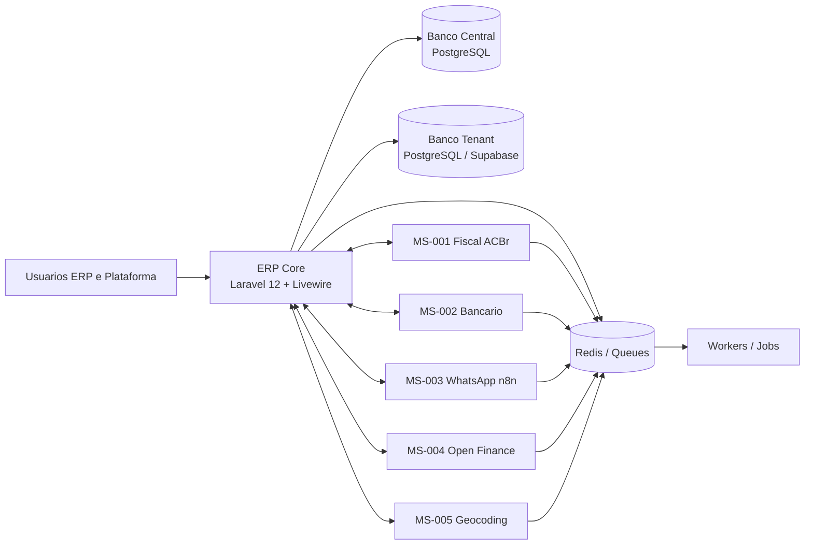

# BateriaExpert ERP

[](#testes)
[](#testes)
[](#stack)
[](#stack)
[](./composer.json)
[](#rodando-com-docker)
[](#kubernetes-deploy-checklist)
[](https://github.com/acaciabaterias/laravel12-jetstream-template)

ERP especializado para distribuidores, revendas e operacoes de baterias automotivas, com arquitetura `database-per-client`, backoffice SaaS central e microservicos dedicados para fiscal, bancario, notificacoes, Open Finance e geocoding.

## Visao Geral

O BateriaExpert foi estruturado como um monorepo com:

- ERP Core em Laravel 12
- Autenticacao e UI com Jetstream, Livewire e Volt
- Banco central para catalogo SaaS, assinaturas e provisionamento
- Bancos isolados por tenant/CNPJ
- Microservicos independentes para integracoes especializadas

Os modulos core cobrem:

- multi-tenancy isolado
- RBAC
- cadastros estruturais
- estoque e logistica reversa
- vendas, pedidos e OS
- logistica e entregas
- garantias e feedback
- financeiro inteligente
- orquestracao fiscal e bancaria
- backbone de integracao e observabilidade
- billing control plane central
- pagamentos SaaS e reconciliacao central
- recuperacao de receita e dunning central
- analytics comercial central
- hub executivo central com exportação auditável
- automacao avancada de recuperacao com experimento e rollback governado
- internacionalizacao central com fallback governado e rollback auditavel

## Arquitetura



## Backbone de Integracao

O modulo `010` adiciona a espinha dorsal assíncrona entre ERP e microservicos:

- `evento_outboxes` para publicação confiável
- `evento_inboxes` para consumo idempotente
- `entregas_integracao` para retries, dead-letter e replay
- `contratos_evento` e `endpoints_integracao` para governança operacional
- dashboard `/integration/backbone` e API `/api/integration/inspections` para operação

## Payments Control Plane

O modulo `012` fecha o ciclo financeiro externo do SaaS:

- emissão de cobranças externas vinculadas a `FaturaSaaS`
- webhooks e retornos idempotentes
- conciliação automática segura
- replay manual de retornos em `platform-payments:replay-return`
- dashboard `/admin/payments` e inspeção `/admin/payments/inspection`

## Revenue Recovery Control Plane

O modulo `013` adiciona a camada central de recuperação de receita:

- abertura de casos a partir de atraso ou falha de cobrança
- deduplicação por estágio e canal
- escalonamento humano de casos críticos
- promessas de pagamento com suspensão seletiva das ações automáticas
- dashboard `/admin/recovery`, operação `/admin/recovery/operacoes` e inspeção `/admin/recovery/inspection`

## Commercial Analytics Control Plane

O modulo `014` consolida a leitura executiva central da plataforma:

- snapshots executivos de MRR, churn, inadimplencia, recuperacao e bloqueios
- recortes por coorte e canal reconstruiveis a partir dos modulos `011`, `012` e `013`
- drill-down operacional reutilizavel para inspecao e suporte
- dashboard `/admin/analytics` e inspecao `/admin/analytics/inspection`

## Production Observability Assurance

O modulo `015` fecha a governanca operacional central da plataforma:

- snapshots operacionais com classificacao explicita de severidade
- comparacao de baseline de carga por fluxo critico
- incidentes operacionais centrais com evidencia de runbook
- encerramento auditavel com validacao posterior obrigatoria
- dashboard `/admin/operations` e inspecao `/admin/operations/inspection`

## Backbone Monitoring Consolidation

O modulo `016` consolida a camada externa de monitoramento sem deslocar a governanca para fora do ERP:

- catalogo central de targets e snapshots de scrape health
- regras de alerta versionadas com avaliacao material por fluxo
- dashboard `/admin/monitoring` e inspecao `/admin/monitoring/inspection`
- provisionamento, validacao e rollback auditavel de dashboards/alertas por ambiente
- evidencias centrais de readiness para Prometheus, Grafana e exporters criticos

## Critical Integration Load Optimization

O modulo `017` fecha a camada preventiva de capacidade e tuning das integracoes criticas:

- perfis de carga reproduziveis com baseline promovivel por fluxo e ambiente
- benchmark central com classificacao explicita de ganho, estabilidade ou regressao
- catalogo auditavel de gargalos por banco, fila, integracao externa e aplicacao
- lifecycle de tuning com validacao, promocao e rollback com evidencia persistida
- dashboard `/admin/capacity` e inspecao `/admin/capacity/inspection`

## Advanced White Label Experience

O modulo `018` fecha a governanca visual central da plataforma multi-tenant:

- identidades visuais centralizadas por tenant com ativos e tokens obrigatorios
- temas versionados com validacao minima de contraste e completude antes da publicacao
- publicacao auditavel e rollback para a ultima versao saudavel ou fallback seguro
- integracao do branding ativo ao shell atual do ERP sem customizacao manual em arquivos do deploy
- dashboard `/admin/branding` e inspecao `/admin/branding/inspection`

## Executive Reporting Hub

O modulo `019` fecha a camada executiva de consumo da informacao:

- dashboard `/admin/reports` com filtros por periodo, plano, canal, carteira e recovery
- snapshots executivos reutilizaveis para manter coerencia entre cards, drill-down e inspecao JSON
- exportacao Excel/PDF auditavel a partir do mesmo recorte analitico
- historico central de geracoes e reexecucoes com `scope_summary`, operador e snapshot associado
- eventos materiais publicados no backbone `010` para geracao, reexecucao e falha

## Advanced Revenue Recovery Automation

O modulo `020` fecha a camada adaptativa de cobranca central:

- jornadas automaticas com fallback por canal, cooldown e supressao reutilizando os casos do modulo `013`
- politicas versionadas com publicacao governada, experimento controlado e holdout persistente por jornada
- rollback auditavel para a ultima politica saudavel com marcacao explicita das jornadas afetadas
- dashboard `/admin/recovery/automation` e inspecao `/admin/recovery/automation/inspection`

## Platform Internationalization

O modulo `021` fecha a camada de internacionalizacao central da plataforma:

- preferencia de idioma persistida por operador em `pt_BR`, `en` e `es`
- resolucao segura por request administrativo com fallback ativo e protecao contra locale invalido
- publicacao governada de bundles de locale com cobertura minima para chaves criticas
- inspecao central de lacunas por severidade e rollback auditavel da ultima publicacao saudavel
- dashboard `/admin/localization` e inspecao `/admin/localization/inspection`

## Multi-Currency Support

O modulo `022` fecha a camada monetaria central da plataforma:

- preferencia de moeda persistida por operador em `BRL`, `USD` e `EUR`
- projecao de valores centrais a partir da moeda base sem sobrescrever o historico original
- publicacao governada de moedas suportadas, taxa ativa e issue reports de cobertura
- inspecao central de cambio e rollback auditavel da ultima publicacao saudavel
- dashboard `/admin/currencies` e inspecao `/admin/currencies/inspection`

## Fiscal CFOP Export/Import

O modulo `023` fecha a camada central de governanca fiscal para exportacao e importacao:

- consulta de enquadramento por cenario com fallback governado quando a regra ativa estiver ausente ou invalida
- publicacao versionada de catalogo CFOP e mappings fiscais com snapshot de cobertura obrigatoria
- inspecao central de issues por severidade, historico de publicacoes e rollback auditavel da ultima publicacao elegivel
- dashboard `/admin/fiscal-rules` e inspecao `/admin/fiscal-rules/inspection`

## Stack

- PHP `^8.3`
- Laravel `12`
- Livewire `4`
- Volt
- Tailwind CSS `4`
- PostgreSQL `15+`
- Redis
- Vite
- Docker Compose para ambiente integrado

## Pre-requisitos

Para desenvolvimento local sem Docker:

- PHP `8.3+`
- Composer `2+`
- Node.js `20+`
- npm
- PostgreSQL `15+`
- Redis

Para ambiente integrado:

- Docker
- Docker Compose

## Instalacao Local

### 1. Clonar o repositorio

```bash
git clone <seu-repo>.git
cd laravel12-jetstream-template
```

### 2. Instalar dependencias

```bash
composer install
npm install
```

### 3. Configurar ambiente

```bash
cp .env.example .env
php artisan key:generate
```

### 4. Configurar PostgreSQL central

Use o guia:

- [POSTGRESQL_LOCAL_SETUP.md](./POSTGRESQL_LOCAL_SETUP.md)

Depois valide com:

```bash
./check-pg.sh
```

### 5. Ajustar `.env`

Exemplo minimo para o banco central:

```dotenv
DB_CONNECTION=central
DB_CENTRAL_DRIVER=pgsql
DB_CENTRAL_HOST=localhost
DB_CENTRAL_PORT=5432
DB_CENTRAL_DATABASE=erp_central
DB_CENTRAL_USERNAME=gil
DB_CENTRAL_PASSWORD=sua_senha
```

### 6. Rodar migrations centrais

```bash
php artisan migrate --database=central --path=database/migrations/central --no-interaction
```

### 7. Popular dados iniciais

```bash
php artisan db:seed --class=PlanosSeeder --no-interaction
php artisan db:seed --class=SuperAdminSeeder --no-interaction
```

### 8. Subir a aplicacao

```bash
composer run dev
```

Se preferir processos separados:

```bash
php artisan serve
php artisan queue:listen --tries=1
npm run dev
```

## 📚 Documentação

- **[README.md](README.md)** - Visão geral do projeto
- **[ARCHITECTURE.md](ARCHITECTURE.md)** - Arquitetura do sistema e diagramas
- **[DATABASE.md](DATABASE.md)** - Modelo de dados e relacionamentos
- **[API_GUIDE.md](API_GUIDE.md)** - Guia de uso da API
- **[MICROSERVICES.md](MICROSERVICES.md)** - Detalhamento dos microserviços
- **[FAQ.md](FAQ.md)** - Perguntas frequentes
- **[CONTRIBUTING.md](CONTRIBUTING.md)** - Guia para contribuidores
- **[CODE_OF_CONDUCT.md](CODE_OF_CONDUCT.md)** - Código de conduta
- **[SECURITY.md](SECURITY.md)** - Política de segurança
- **[SUPPORT.md](SUPPORT.md)** - Canais de suporte
- **[CHANGELOG.md](CHANGELOG.md)** - Histórico de versões
- **[ROADMAP.md](ROADMAP.md)** - Roadmap do projeto
- **[RELEASE_PROCESS.md](RELEASE_PROCESS.md)** - Processo de release
- **[GO_LIVE_RUNBOOK.md](GO_LIVE_RUNBOOK.md)** - Runbook de go-live e rollback
- **[TROUBLESHOOTING.md](TROUBLESHOOTING.md)** - Solução de problemas

## Testes

Rodar a suite completa:

```bash
php artisan test --compact
```

Rodar um arquivo especifico:

```bash
php artisan test --compact tests/Feature/SalesServiceOsTest.php
```

Formatacao:

```bash
vendor/bin/pint --dirty --format agent
```

Para o recorte operacional central do modulo `015`, os testes chave incluem:

```bash
php artisan test --compact tests/Feature/ProductionObservabilityDashboardTest.php
php artisan test --compact tests/Feature/ProductionObservabilitySnapshotTest.php
php artisan test --compact tests/Feature/ProductionObservabilityLoadBaselineTest.php
php artisan test --compact tests/Feature/ProductionObservabilityIncidentInspectionTest.php
```

Para o recorte de automacao avancada do modulo `020`, os testes chave incluem:

```bash
php artisan test --compact tests/Feature/AdvancedRecoveryAutomationJourneyTest.php
php artisan test --compact tests/Feature/AdvancedRecoveryAutomationPublicationTest.php
php artisan test --compact tests/Feature/AdvancedRecoveryAutomationInspectionTest.php
php artisan test --compact tests/Feature/AdvancedRecoveryAutomationGovernanceTest.php
```

Para o recorte de internacionalizacao da plataforma do modulo `021`, os testes chave incluem:

```bash
php artisan test --compact tests/Feature/PlatformLocalizationPreferenceTest.php
php artisan test --compact tests/Feature/PlatformLocalizationPublicationTest.php
php artisan test --compact tests/Feature/PlatformLocalizationInspectionTest.php
php artisan test --compact tests/Feature/PlatformLocalizationRollbackTest.php
```

Para o recorte de multiplas moedas da plataforma do modulo `022`, os testes chave incluem:

```bash
php artisan test --compact tests/Feature/PlatformCurrencyPreferenceTest.php
php artisan test --compact tests/Feature/PlatformCurrencyPublicationTest.php
php artisan test --compact tests/Feature/PlatformCurrencyInspectionTest.php
php artisan test --compact tests/Feature/PlatformCurrencyRollbackTest.php
```

Para o recorte fiscal governado do modulo `023`, os testes chave incluem:

```bash
php artisan test --compact tests/Feature/PlatformFiscalScenarioLookupTest.php
php artisan test --compact tests/Feature/PlatformFiscalPublicationTest.php
php artisan test --compact tests/Feature/PlatformFiscalInspectionTest.php
php artisan test --compact tests/Feature/PlatformFiscalRollbackTest.php
```

### Documentação da API (OpenAPI/Swagger)

A documentação interativa da API está disponível em [/api/docs](/api/docs) (requer autenticação).

## Testes de carga com K6

Os cenarios K6 ficam em `tests/k6/`:

- `load-test-create-vale.js`: autentica na aplicacao, abre o `dashboard`, executa `createVale` e `addItem` via `POST /livewire/update`
- `load-test-concurrent-users.js`: simula `100` usuarios simultaneos navegando por home, login e dashboard autenticado
- `smoke-test.js`: valida rapidamente home, login e dashboard; opcionalmente cria um vale simples

Variaveis de ambiente suportadas:

```bash
export BASE_URL=http://127.0.0.1:8000
export USER_EMAIL=vendedor.demo@bateriaexpert.test
export USER_PASSWORD=password
```

Executar o smoke test:

```bash
k6 run tests/k6/smoke-test.js
```

Executar o smoke test com criacao de vale:

```bash
SMOKE_CREATE_VALE=true k6 run tests/k6/smoke-test.js
```

Executar o teste de carga de criacao de vales:

```bash
k6 run tests/k6/load-test-create-vale.js
```

Executar o teste de concorrencia com `100` usuarios:

```bash
k6 run tests/k6/load-test-concurrent-users.js
```

Executar o teste de carga multi-tenant variando o `Host` entre muitos clientes:

```bash
TENANT_HOSTS=loadtest-001.erp.local,loadtest-002.erp.local,loadtest-003.erp.local \
BASE_URL=http://127.0.0.1:8000 \
k6 run tests/k6/load-test-multi-tenant-dashboard.js
```

Esse cenario usa o endpoint leve `/load/tenant-probe` em ambiente `local/testing` para medir resolucao tenant, bootstrap web e troca de conexao por subdominio sem ruido de autenticacao ou dashboard administrativo.

Se preferir gerar a lista de hosts dinamicamente, o script tambem aceita `TENANT_PREFIX`, `TENANT_BASE_DOMAIN` e `TENANT_COUNT`:

```bash
TENANT_PREFIX=loadtest \
TENANT_BASE_DOMAIN=erp.local \
TENANT_COUNT=100 \
BASE_URL=http://127.0.0.1:8000 \
k6 run tests/k6/load-test-multi-tenant-dashboard.js
```

Para preparar massa central de tenants de carga:

```bash
php artisan db:seed --class=LoadTestTenantSeeder --no-interaction
```

Se a aplicacao estiver servindo frontend e backend separadamente, garanta que `php artisan serve` e `npm run dev` ou `composer run dev` estejam ativos antes de rodar os cenarios.

### Rate Limiting Multi-tenant

O sistema aplica limites de requisições baseados no plano do cliente para garantir estabilidade e previsibilidade.

| Plano | Limite (Req/min) |
| :--- | :--- |
| **Free** | 60 |
| **Pro** | 600 |
| **Enterprise** | 6000 |

#### Cabeçalhos HTTP
As requisições retornam cabeçalhos informativos:
- `X-RateLimit-Limit`: Limite total permitido.
- `X-RateLimit-Remaining`: Requisições restantes na janela atual.
- `X-RateLimit-Reset`: Timestamp Unix de quando o limite será resetado.

#### Tratamento de Erros
Quando o limite é excedido, a API retorna `HTTP 429 Too Many Requests`. O cliente deve aguardar o tempo indicado no cabeçalho `Retry-After` (segundos) antes de tentar novamente.

#### Reset Manual
Administradores podem resetar os limites via Artisan:
```bash
# Reset para um tenant específico
php artisan tenant:ratelimit-reset --tenant=subdominio

# Reset global
php artisan tenant:ratelimit-reset --all
```

## Rodando com Docker

O `docker-compose.yml` da raiz sobe os microservicos scaffoldados:

- `MS-001 Fiscal`
- `MS-002 Bancario`
- `MS-003 WhatsApp n8n`
- `MS-004 Open Finance`
- `MS-005 Geocoding`

Subir o stack:

```bash
docker compose up -d --build
```

Se a porta `8000` ja estiver em uso, defina outra porta para o ERP Core:

```bash
ERP_CORE_HTTP_PORT=8080 docker compose up -d --build
```

Validar containers:

```bash
docker compose ps
```

Executar healthcheck:

```bash
./healthcheck.sh
```

## Scripts Operacionais

- [check-pg.sh](./check-pg.sh): verifica PostgreSQL local
- [backup.sh](./backup.sh): backup do banco central e opcionalmente de tenant
- [restore.sh](./restore.sh): restore a partir de dump PostgreSQL
- [healthcheck.sh](./healthcheck.sh): valida endpoints principais

## Documentacao

### API

- [openapi.yaml](./openapi.yaml)
- [postman_collection.json](./postman_collection.json)
- [API_GUIDE.md](./API_GUIDE.md)
- [MICROSERVICES.md](./MICROSERVICES.md)

### Deploy

- [DEPLOY_PROXMOX.md](./DEPLOY_PROXMOX.md)
- [DEPLOY_SUPABASE.md](./DEPLOY_SUPABASE.md)
- [DEPLOY_PRODUCAO.md](./DEPLOY_PRODUCAO.md)
- [DEPLOYMENT_DETAILED.md](./DEPLOYMENT_DETAILED.md)
- [GO_LIVE_RUNBOOK.md](./GO_LIVE_RUNBOOK.md)

### Operacao

- [TROUBLESHOOTING.md](./TROUBLESHOOTING.md)
- [PERFORMANCE.md](./PERFORMANCE.md)

### Governanca

- [CONTRIBUTING.md](./CONTRIBUTING.md)
- [CODE_OF_CONDUCT.md](./CODE_OF_CONDUCT.md)
- [SECURITY.md](./SECURITY.md)
- [SUPPORT.md](./SUPPORT.md)
- [CHANGELOG.md](./CHANGELOG.md)

### Banco de dados

- [database/schema/central_postgres.sql](./database/schema/central_postgres.sql)
- [database/schema/tenant_postgres.sql](./database/schema/tenant_postgres.sql)
- [database/schema/tenant_rls_policies.sql](./database/schema/tenant_rls_policies.sql)

## GitHub Actions

Workflows incluidos em [`.github/workflows`](./.github/workflows):

- `test.yml`: executa PHPUnit, build Vite, valida Compose e build da imagem Docker do ERP Core
- `lint.yml`: valida Pint, `php -l` e a collection Postman
- `deploy.yml`: valida o bundle e prepara deploy manual por ambiente
- `deploy-k8s.yml`: aplica manifests Kubernetes por ambiente com smoke test

## Estrutura do Monorepo

```text
app/                      ERP Core
database/migrations/      Migracoes legadas e operacionais
database/migrations/central
database/migrations/tenant
database/schema/          Snapshots SQL canônicos
microservicos/
  ms-001-fiscal-acbr/
  ms-002-bancario/
  ms-003-whatsapp-n8n/
  ms-004-openfinance/
  ms-005-geocoding/
.github/workflows/        CI/CD
```

## Ponto de Entrada para Desenvolvimento

Se voce esta chegando agora no projeto, a ordem recomendada e:

1. Ler este README
2. Configurar PostgreSQL com [POSTGRESQL_LOCAL_SETUP.md](./POSTGRESQL_LOCAL_SETUP.md)
3. Rodar `./check-pg.sh`
4. Aplicar migrations centrais
5. Rodar `php artisan test --compact`
6. Consultar [openapi.yaml](./openapi.yaml) e a collection Postman
7. Usar os guias de deploy conforme o ambiente alvo

## Licenca

Este projeto utiliza licenca MIT. Consulte o metadata em [composer.json](./composer.json).
